第三十二~三十三章：最小操作数，木块砌墙问题
---

作者：July、caopengcs、红色标记。致谢：fuwutu、demo。

时间：二零一三年八月十二日

##题记

&emsp;&emsp;再过一两月，便又到了每年的九月十月校招高峰期，在此依次推荐：

&emsp;&emsp;1. 程序员编程艺术<http://blog.csdn.net/column/details/taopp.html>；

&emsp;&emsp;2. 秒杀99%的海量数据处理面试题<http://blog.csdn.net/v_july_v/article/details/7382693>；

&emsp;&emsp;3. 《编程之美》；

&emsp;&emsp;4. 微软面试100题系列<http://blog.csdn.net/column/details/ms100.html>；

&emsp;&emsp;5. 《剑指offer》

&emsp;&emsp;一年半前在学校的那会，我曾经无比疯狂的创作程序员编程艺术这个系列，因为当时我坚信它能帮到更多的人找到更好的工作，此刻今后，我更加无比坚信这点。

&emsp;&emsp;同时，相信你也已看到，编程艺术系列的创作原则是把受众定位为一个编程初学者，从看到问题后最先想到的思路开始讲解，一点一点改进，不断优化。

&emsp;&emsp;而本文主要讲下述两个问题：

* 第三十二章：最小操作数问题，主要由caopengcs完成；
* 第三十三章：木块砌墙问题，主要由红色标记和caopengcs完成。

&emsp;&emsp;全文由July统一整理修订完成。OK，还是很真诚的那句话：有任何问题，欢迎读者随时批评指正，感谢。

##第三十二章、最小操作数

&emsp;&emsp;题目详情如下：

&emsp;&emsp;给定一个单词集合Dict，其中每个单词的长度都相同。现从此单词集合Dict中抽取两个单词A、B，我们希望通过若干次操作把单词A变成单词B，每次操作可以改变单词的一个字母，同时，新产生的单词必须是在给定的单词集合Dict中。求所有行得通步数最少的修改方法。

&emsp;&emsp;举个例子如下：
	
	Given:
	   A = "hit"
	   B = "cog"
	   Dict = ["hot","dot","dog","lot","log"]
	Return
	 [
	   ["hit","hot","dot","dog","cog"],
	   ["hit","hot","lot","log","cog"]
	 ]

&emsp;&emsp;即把字符串A = "hit"转变成字符串B = "cog"，有以下两种可能：

&emsp;&emsp;&emsp;&emsp;"hit" -> "hot" ->  "dot" ->  "dog" -> "cog"；

&emsp;&emsp;&emsp;&emsp;"hit" ->  "hot" ->  "lot" ->  "log"  ->"cog"。

&emsp;&emsp;__详解__：本题是一个典型的图搜索算法问题。此题看似跟本系列的第29章的字符串编辑距离相似，但其实区别特别大，原因是最短编辑距离是让某个单词增加一个字符或减少一个字符或修改一个字符达到目标单词，来求变换的最少次数，但此最小操作数问题就只是改变一个字符。 

&emsp;&emsp;通过此文：<http://blog.csdn.net/v_JULY_v/article/details/6111353>，我们知道，在图搜索算法中，有深度优先遍历DFS和广度优先遍历BFS，而题目中并没有给定图，所以需要我们自己建立图。


&emsp;&emsp;涉及到图就有这么几个问题要思考，节点是什么？边如何建立？图是有方向的还是无方向的？包括建好图之后，如何记录单词序列等等都是我们要考虑的问题。

###解法一、单向BFS法

&emsp;&emsp;__1__、建图

&emsp;&emsp;对于本题，我们的图的节点就是字典里的单词，两个节点有连边，对应着我们可以把一个单词按照规则变为另外一个单词。比如我们有单词hat，它应该与单词cat有一条连边，因为我们可以把h变为c，反过来我们也可以把c变为h，所以我们建立的连边应该是无向的。

&emsp;&emsp;如何建图？有两种办法，

* 第一种方法是：我们可以把字典里的任意两个单词，通过循环判断一下这两个单词是否只有一个位置上的字母不同。即假设字典里有n个单词，我们遍历任意两个单词的复杂度是O(n2)，如果每个单词长度为length，我们判断两个单词是否连边的复杂度是O(length)，所以这个建图的总复杂度是O(n2*length)。但当n比较大时，这个复杂度非常高，有没有更好的方法呢？

* 第二种方法是：我们把字典里地每个单词的每个位置的字母修改一下，从字典里查找一下（若用基于red-black tree的map查找，其查找复杂度为O(logn)，若用基于hashmap的unordered_map，则查找复杂度为O(1)），修改后的单词是否在字典里出现过。即我们需要遍历字典里地每一个单词O(n)，尝试修改每个位置的每个字母，对每个位置我们需要尝试26个字母（其实是25个，因为要改得和原来不同），因此这部分复杂度是O(26*length)，总复杂度是O(26 * n * length)  （第二种方法优化版：这第二种方法能否更优？在第二种方法中，我们对每个单词每个位置尝试了26次修改，事实上我们可以利用图是无向的这一特点，我们对每个位置试图把该位置的字母变到字典序更大的字母。例如，我们只考虑cat变成hat，而不考虑hat变成cat，因为再之前已经把无向边建立了。这样，只进行一半的修改次数，从而减少程序的运行时间。当然这个优化从复杂度上来讲是常数的，因此称为常数优化，此虽算是一种改进，但不足以成为第三种方法，原因是我们经常忽略O背后隐藏的常数）。

&emsp;&emsp;OK，上面两种方法孰优孰劣呢？直接比较n2*length 与 26 * n * length的大小。很明显，通常情况下，字典里的单词个数非常多，也就是n比较大，因此第二种方法效果会好一些，稍后的参考代码也会选择上述第二种方法的优化。

&emsp;&emsp;__2__、记录单词序列

&emsp;&emsp;对于最简单的bfs，我们是如何记录路径的？如果只需要记录一条最短路径的话，我们可以对每个走到的位置，记录走到它的前一个位置。这样到终点后，我们可以不断找到它的前一个位置。我们利用了最短路径的一个特点：即第二次经过一个节点的时候，路径长度不比第一次经过它时短。因此这样的路径是没有圈的。

&emsp;&emsp;但是本题需要记录全部的路径，我们第二次经过一个节点时，路径长度可能会和第一次经过一个节点时路径长度一样。这是因为，我们可能在第i层中有多个节点可以到达第(i + 1)层的同一个位置，这样那个位置有多条路径都是最短路径。

&emsp;&emsp;如何解决呢？——我们记录经过这个位置的前面所有位置的集合。这样一个节点的前驱不是一个节点，而是一个节点的集合。如此，当我们第二次经过一个第(i+ 1)层的位置时，我们便保留前面那第i层位置的集合作为前驱。

&emsp;&emsp;__3__、遍历

&emsp;&emsp;解决了以上两个问题，我们最终得到的是什么？如果有解的话，我们最终得到的是从终点开始的前一个可能单词的集合，对每个单词，我们都有能得到它的上一个单词的集合，直到起点。这就是bfs分层之后的图，我们从终点开始遍历这个图的到起点的所有路径，就得到了所有的解，这个遍历我们可以采用之前介绍的dfs方法（路径的数目可能非常多）。

&emsp;&emsp;其实，为了简单起见，我们可以从终点开始bfs，因为记录路径记录的是之前的节点，也就是反向的。这样最终可以按顺序从起点遍历到终点的所有路径。

参考代码如下：

```cpp
//copyright@caopengcs     
//updated@July 08/12/2013    
class Solution    
{    
public:    
    // help 函数负责找到所有的路径    
    void help(intx,vector<int> &d, vector<string> &word,vector<vector<int> > &next,vector<string> &path,vector<vector<string> > &answer) {    
        path.push_back(word[x]);    
        if (d[x] == 0) {   //已经达到终点了    
            answer.push_back(path);    
        }    
        else {    
            int i;    
            for (i = 0; i <next[x].size(); ++i) {    
                help(next[x][i],d, word, next,path,answer);    
            }    
        }    
        path.pop_back();   //回溯    
    }    
  
    vector<vector<string>> findLadders(string start, string end, set<string>& dict)    
    {    
  
        vector<vector<string> > answer;    
        if (start == end) {   //起点终点恰好相等    
            return answer;    
        }    
        //把起点终点加入字典的map    
        dict.insert(start);    
        dict.insert(end);    
        set<string>::iterator dt;    
        vector<string> word;    
        map<string,int>allword;    
        //把set转换为map，这样每个单词都有编号了。    
        for (dt = dict.begin(); dt!= dict.end(); ++dt) {    
            word.push_back(*dt);    
            allword.insert(make_pair(*dt, allword.size()));    
        }    
  
        //建立连边 邻接表    
        vector<vector<int> > con;    
        int i,j,n =word.size(),temp,len = word[0].length();    
        con.resize(n);    
        for (i = 0; i < n; ++i){    
            for (j = 0; j <len; ++j) {    
                char c;    
                for (c =word[i][j] + 1; c <= 'z'; ++c) {  //根据上面第二种方法的优化版的思路，让每个单词每个位置变更大    
                    char last =word[i][j];    
                    word[i][j] =c;    
                    map<string,int>::iterator t = allword.find(word[i]);    
                    if (t !=allword.end()) {    
                        con[i].push_back(t->second);    
                        con[t->second].push_back(i);    
                    }    
                    word[i][j] =last;    
                }    
            }    
  
        }    
  
        //以下是标准bfs过程    
        queue<int> q;    
        vector<int> d;    
        d.resize(n, -1);    
        int from = allword[start],to = allword[end];    
        d[to] = 0;  //d记录的是路径长度，-1表示没经过    
        q.push(to);    
        vector<vector<int> > next;    
        next.resize(n);    
        while (!q.empty()) {    
            int x = q.front(), now= d[x] + 1;    
            //now相当于路径长度  
            //当now > d[from]时，则表示所有解都找到了  
            if ((d[from] >= 0)&& (now > d[from])) {    
                break;    
            }    
            q.pop();    
            for (i = 0; i <con[x].size(); ++i) {    
                int y = con[x][i];    
                //第一次经过y  
                if (d[y] < 0) {      
                    d[y] = now;    
                    q.push(y);    
                    next[y].push_back(x);    
                }    
                //非第一次经过y  
                else if (d[y] ==now) {  //是从上一层经过的，所以要保存    
                    next[y].push_back(x);    
                }    
  
            }    
        }    
        if (d[from] >= 0) {  //有解    
            vector<string>path;    
            help(from, d,word,next, path,answer);    
        }    
        return answer;    
    }    
};
```

###解法二、双向BFS法

&emsp;&emsp;BFS需要把每一步搜到的节点都存下来，很有可能每一步的搜到的节点个数越来越多，但最后的目的节点却只有一个。后半段的很多搜索都是白耗时间了。

&emsp;&emsp;上面给出了单向BFS的解法，但看过此前blog中的这篇文章“A*、Dijkstra、BFS算法性能比较演示”可知：<http://blog.csdn.net/v_JULY_v/article/details/6238029>，双向BFS性能优于单向BFS。

&emsp;&emsp;举个例子如下，第1步，是起点，1个节点，第2步，搜到2个节点，第3步，搜到4个节点，第4步搜到8个节点，第5步搜到16个节点，并且有一个是终点。那这里共出现了31个节点。从起点开始广搜的同时也从终点开始广搜，就有可能在两头各第3步，就相遇了，出现的节点数不超过(1+2+4)*2=14个，如此就节省了一半以上的搜索时间。

&emsp;&emsp;下面给出双向BFS的解法，参考代码如下：

```cpp
//copyright@fuwutu 6/26/2013  
class Solution  
{  
public:  
    vector<vector<string>> findLadders(string start, string end, set<string>& dict)  
    {  
        vector<vector<string>> result, result_temp;  
        if (dict.erase(start) == 1 && dict.erase(end) == 1)   
        {  
            map<string, vector<string>> kids_from_start;  
            map<string, vector<string>> kids_from_end;  
  
            set<string> reach_start;  
            reach_start.insert(start);  
            set<string> reach_end;  
            reach_end.insert(end);  
  
            set<string> meet;  
            while (meet.empty() && !reach_start.empty() && !reach_end.empty())  
            {  
                if (reach_start.size() < reach_end.size())  
                {  
                    search_next_reach(reach_start, reach_end, meet, kids_from_start, dict);  
                }  
                else  
                {  
                    search_next_reach(reach_end, reach_start, meet, kids_from_end, dict);  
                }  
            }  
  
            if (!meet.empty())  
            {  
                for (set<string>::iterator it = meet.begin(); it != meet.end(); ++it)  
                {  
                    vector<string> words(1, *it);  
                    result.push_back(words);  
                }  
  
                walk(result, kids_from_start);  
                for (size_t i = 0; i < result.size(); ++i)  
                {  
                    reverse(result[i].begin(), result[i].end());  
                }  
                walk(result, kids_from_end);  
            }  
        }  
  
        return result;  
    }  
  
private:  
    void search_next_reach(set<string>& reach, const set<string>& other_reach, set<string>& meet, map<string, vector<string>>& path, set<string>& dict)  
    {  
        set<string> temp;  
        reach.swap(temp);  
  
        for (set<string>::iterator it = temp.begin(); it != temp.end(); ++it)  
        {  
            string s = *it;  
            for (size_t i = 0; i < s.length(); ++i)  
            {  
                char back = s[i];  
                for (s[i] = 'a'; s[i] <= 'z'; ++s[i])  
                {  
                    if (s[i] != back)  
                    {  
                        if (reach.count(s) == 1)  
                        {  
                            path[s].push_back(*it);  
                        }  
                        else if (dict.erase(s) == 1)  
                        {  
                            path[s].push_back(*it);  
                            reach.insert(s);  
                        }  
                        else if (other_reach.count(s) == 1)  
                        {  
                            path[s].push_back(*it);  
                            reach.insert(s);  
                            meet.insert(s);  
                        }  
                    }  
                }  
                s[i] = back;  
            }  
        }  
    }  
  
    void walk(vector<vector<string>>& all_path, map<string, vector<string>> kids)  
    {  
        vector<vector<string>> temp;  
        while (!kids[all_path.back().back()].empty())  
        {  
            all_path.swap(temp);  
            all_path.clear();  
            for (vector<vector<string>>::iterator it = temp.begin(); it != temp.end(); ++it)  
            {  
                vector<string>& one_path = *it;  
                vector<string>& p = kids[one_path.back()];  
                for (size_t i = 0; i < p.size(); ++i)  
                {  
                    all_path.push_back(one_path);  
                    all_path.back().push_back(p[i]);  
                }  
            }  
        }  
    }  
};  
```


##第三十三章、木块砌墙

__题目__：用 1×1×1, 1× 2×1以及2×1×1的三种木块（横绿竖蓝，且绿蓝长度均为2），

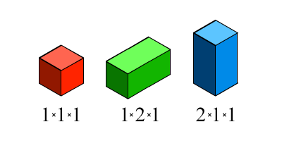

搭建高长宽分别为K × 2^N × 1的墙，不能翻转、旋转（其中，0<=N<=1024，1<=K<=4）


有多少种方案，输出结果

对1000000007取模。

举个例子如给定高度和长度：N=1 K=2，则答案是7，即有7种搭法，如下图所示：


__详解__：此题很有意思，涉及的知识点也比较多，包括动态规划，快速矩阵幂，状态压缩，排列组合等等都一一考察了个遍。而且跟一个比较经典的矩阵乘法问题类似：即用1 x 2的多米诺骨牌填满M x N的矩形有多少种方案，M<=5，N<2^31，输出答案mod p的结果

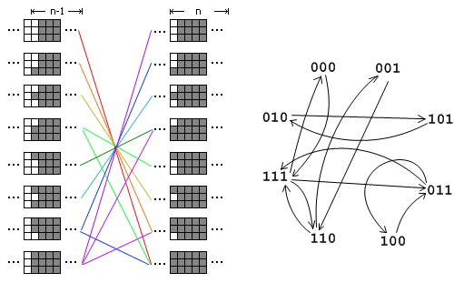

OK，回到正题。下文使用的图示说明(所有看到的都是横切面)：


首先说明“？方块”的作用

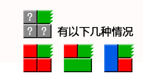

“？方块”，表示这个位置是空位置，可以任意摆放。

上图的意思就是，当右上角被绿色木块占用，此位置固定不变，其他位置任意摆放，在这种情况下的堆放方案数。

###解法一、穷举遍历

&emsp;&emsp;初看此题，你可能最先想到的思路便是穷举：用二维数组模拟墙，从左下角开始摆放，从左往右，从下往上，最后一个格子是右上角那个位置；每个格子把每种可以摆放木块都摆放一次，每堆满一次算一种用摆放方法。为了便于描述，为木块的每个格子进行编号：

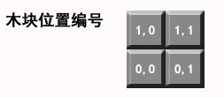

下面演示当n=1,k=2的算法过程（7种情况）：

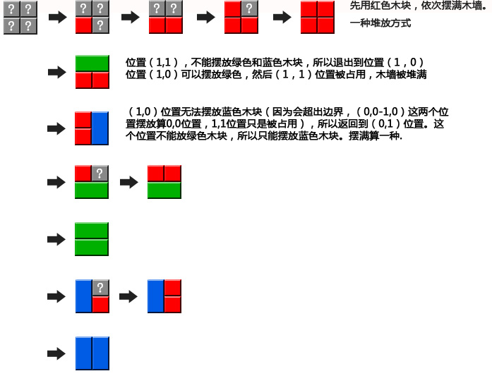

&emsp;&emsp;穷举遍历在数据规模比较小的情况下还撑得住，但在0<=N<=1024这样的数据规模下，此方法则立刻变得有心无力，因此我们得寻找更优化的解法。

###解法二、递归分解

递归求解就是把一个大问题，分解成小问题，逐个求解，然后再解决大问题。

####2.1、算法演示

假如有墙规模为(n,k)，如果从中间切开，被分为规模问(n-1,k)的两堵墙，那么被分开的墙和原墙有什么关系呢？我们首先来看一下几组演示。

#####2.1.1、n=1，k=2的情况

首先演示，__n=1,k=2__时的情况，如下图2-1：


&emsp;&emsp;&emsp;&emsp;&emsp;&emsp;&emsp;&emsp;&emsp;&emsp;&emsp;&emsp;&emsp;&emsp;&emsp;图 2-1

上图2-1中：


表示，左边墙的所有堆放方案数 * 右边墙所有堆放方案数 = 2 * 2 = 4


表示，当切开处有一个横条的时候，空位置存在的堆放方案数。左边*右边 = 1*1 = 2；剩余两组以此类推。

这个是排列组合的知识。

#####2.1.2、n=2，k=3的情况

其次，我们再来演示下面更具一般性的计算分解，即当__n=2,k=3__的情况，如下图2-2：

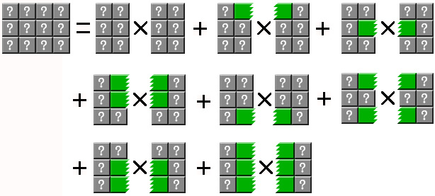

&emsp;&emsp;&emsp;&emsp;&emsp;&emsp;&emsp;&emsp;&emsp;&emsp;&emsp;&emsp;&emsp;&emsp;&emsp;&emsp;&emsp;&emsp;图 2-2

再从分解的结果中，挑选一组进行分解演示：


&emsp;&emsp;&emsp;&emsp;&emsp;&emsp;&emsp;&emsp;&emsp;&emsp;&emsp;&emsp;&emsp;&emsp;&emsp;&emsp;图 2-3

通过图2-2和图2-3的分解演示，可以说明，最终都是分解成一列求解。在逐级向上汇总。

#####2.1.3、n=4，k=3的情况

我们再假设一堵墙n=4，k=3，也就是说，宽度是16，高度是3时，会有以下分解：

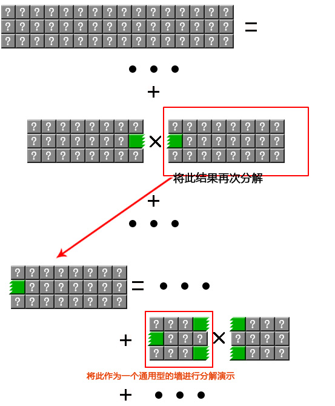

&emsp;&emsp;&emsp;&emsp;&emsp;&emsp;&emsp;&emsp;&emsp;&emsp;&emsp;&emsp;&emsp;&emsp;图2-4

根据上面的分解的一个中间结果，再进行分解，如下：

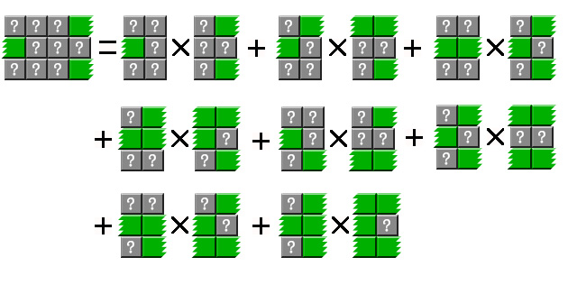

&emsp;&emsp;&emsp;&emsp;&emsp;&emsp;&emsp;&emsp;&emsp;&emsp;&emsp;&emsp;&emsp;&emsp;&emsp;&emsp;&emsp;&emsp;图2-5

&emsp;&emsp;通过上面图2-1~图2-5的演示可以明确如下几点：

&emsp;&emsp;1.假设f(n)用于计算问题，那么f(n)依赖于f(n-1)的多种情况。

&emsp;&emsp;2.切开处有什么特殊的地方呢？通过上面的演示，我们得知被切开的两堵墙从没有互相嵌入的木块（绿色木块）到全是互相连接的木块，相当于切口绿色木块的全排列（即有绿色或者没有绿色的所有排列），即有2^k种状态（比如k=2，且有绿色用1表示，没有绿色用0表示，那么就有00、01、10、11这4种状态）。根据排列组合的性质，把每一种状态下左右木墙堆放方案数相乘，再把所有乘积求和，就得到木墙的堆放结果数。以此类推，将问题逐步往下分解即可。

&emsp;&emsp;3.此外，从图2-5中可以看出，除了需要考虑切口绿色木块的状态，还需要考虑最左边一列和最右边一列的绿色木块状态。我们把这两种边界状态称为左边界状态和右边界状态，分别用leftState和rightState表示。 

且在观察图2-5被切分后，所有左边的墙，他们的左边界ls状态始终保持不变，右边界rs状态从0~maxState, maxState = 2^k-1（有绿色方块表示1，没有表示0；ls表示左边界状态，rs表示右边状态）：


&emsp;&emsp;&emsp;&emsp;&emsp;&emsp;&emsp;&emsp;&emsp;&emsp;&emsp;&emsp;&emsp;&emsp;&emsp;&emsp;&emsp;&emsp;图2-6

&emsp;&emsp;同样可以看出右边的墙的右边界状态保持不变，而左边界状态从0~maxState。要堆砌的木墙可以看做是左边界状态=0，和右边界状态=0的一堵墙。

&emsp;&emsp;有一点可能要特别说明下，即上文中说，有绿色方块的状态表示标为1，无绿色方块的状态表示标为0，特意又拿上图2-6标记了一些数字，以让绝大部分读者能看得一目了然，如下所示：


&emsp;&emsp;&emsp;&emsp;&emsp;&emsp;&emsp;&emsp;&emsp;&emsp;&emsp;&emsp;&emsp;&emsp;&emsp;&emsp;&emsp;&emsp;&emsp;&emsp;图2-7

这下，你应该很清楚的看到，在上图中，左边木块的状态表示一律为010，右边木块的状态表示则是000~111（即从下至上开始计数，右边木块rs的状态用二进制表示为：000 001 010 011 100 101 110 111，它们各自分别对应整数则是：0 1 2 3 4 5 6 7）。

####2.2、计算公式

通过图2-4、图2-5、图2-6的分解过程，我们可以总结出下面公式（leftState=最左边边界状态，rightState=最右边边界状态）：


即：

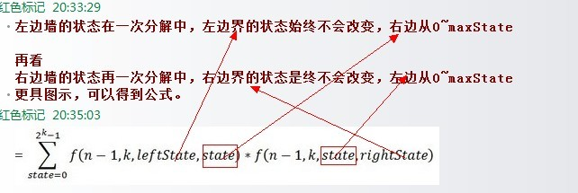

&emsp;&emsp;接下来，分3点解释下上述公式：

&emsp;&emsp;__1__、上述函数返回结果是当左边状态为=leftState，右边状态=rightState时木墙的堆砌方案数，相当于直接分解的左右状态都为0的情况，即直接分解f(n,k,0,0)即可。看到这，读者可能便有疑问了，既然直接分解f(n,k,0,0)即可，为何还要加leftstate和leftstate两个变量呢？回顾下2.1.3节中n=4，k=3的演示例子，即当n=4，k=3时，其分解过程即如下图（上文2.1.3节中的图2-4）


&emsp;&emsp;也就是说，刚开始直接分解f(4,3,0,0)，即n=4，k=3，leftstate=0，rightstate=0，但分解过程中leftstate和rightstate皆从0变化到了maxstate，故才让函数的第3和第4个参数采用leftstate和rightstate这两个变量的形式，公式也就理所当然的写成了f(n,k,leftstate,rightstate)。

&emsp;&emsp;__2__、然后我们再看下当n=4，k=3分解的一个中间结果，即给定如上图最下面部分中红色框框所框住的木块时：


它用方程表示即为 f(2,3,2,5)，怎么得来的呢？其实还是又回到了上文2.1.3节中，当n=2，k=3 时（下图即为上文2.1.3节中的图2-5和图2-6）


&emsp;&emsp;左边界ls状态始终保持不变时，右边界rs状态从0~maxState；右边界状态保持不变时，而左边界状态从0~maxState。

&emsp;&emsp;故上述分解过程用方程式可表示为：

&emsp;&emsp;__f(2,3,2,5)  = f(1,3,2,0) * f(1,3,0,5)__

&emsp;&emsp;&emsp;&emsp;&emsp;&emsp;__+ f(1,3,2,1) * f(1,3,1,5)__

&emsp;&emsp;&emsp;&emsp;&emsp;&emsp;__+ f(1,3,2,2) * f(1,3,2,5)__

&emsp;&emsp;&emsp;&emsp;&emsp;&emsp;__+ f(1,3,2,3) * f(1,3,3,5)__

&emsp;&emsp;&emsp;&emsp;&emsp;&emsp;__+ f(1,3,2,4) * f(1,3,4,5)__

&emsp;&emsp;&emsp;&emsp;&emsp;&emsp;__+ f(1,3,2,5) * f(1,3,5,5)__

&emsp;&emsp;&emsp;&emsp;&emsp;&emsp;__+ f(1,3,2,6) * f(1,3,6,5)__

&emsp;&emsp;&emsp;&emsp;&emsp;&emsp;__+ f(1,3,2,7) * f(1,3,7,5)__

&emsp;&emsp;说白了，我们曾在2.1节中从图2-2到图2-6正推推导出了公式，然上述过程中，则又再倒推推了一遍公式进行了说明。

&emsp;&emsp;__3__、最后，作者是怎么想到引入 leftstate 和rightstate 这两个变量的呢？如红色标记所说："因为切开后，发现绿色条，在分开出不断的变化，当时也进入了死胡同，我就在想，蓝色的怎么办。后来才想明白，与蓝色无关。每一种变化就是一种状态，所以就想到了引入leftstate 和rightstate这两个变量。"

####2.3、参考代码

下面代码就是根据上面函数原理编写的。最终执行效率，n=1024,k=4 时，用时0.2800160秒（之前代码用的是字典作为缓存，用时在1.3秒左右，后来改为数组结果，性能大增）。""

```cs
//copyright@红色标记 12/8/2013    
//updated@July 13/8/2013  
using System;    
using System.Collections.Generic;    
using System.Text;    
using System.Collections;    
  
namespace HeapBlock    
{    
    public class WoolWall    
    {            
        private int n;    
        private int height;    
        private int maxState;    
        private int[, ,] resultCache;   //结果缓存数组    
  
        public WoolWall(int n, int height)    
        {    
            this.n = n;    
            this.height = height;    
            maxState = (1 << height) - 1;    
            resultCache = new int[n + 1, maxState + 1, maxState + 1];   //构建缓存数组，每个值默认为0；    
        }    
  
        /// <summary>    
        /// 静态入口。计算堆放方案数。    
        /// </summary>    
        /// <param name="n"></param>    
        /// <param name="k"></param>    
        /// <returns></returns>    
        public static int Heap(int n, int k)    
        {    
            return new WoolWall(n, k).Heap();    
        }    
  
        /// <summary>    
        /// 计算堆放方案数。    
        /// </summary>    
        /// <returns></returns>    
        public int Heap()    
        {    
            return (int)Heap(n, 0, 0);    
        }    
  
        private long Heap(int n, int lState, int rState)    
        {    
            //如果缓存数组中的值不为0，则表示该结果已经存在缓存中。    
            //直接返回缓存结果。    
            if (resultCache[n, lState, rState] != 0)    
            {    
                return resultCache[n, lState, rState];    
            }    
  
            //在只有一列的情况，无法再进行切分    
            //根据列状态计算一列的堆放方案    
            if (n == 0)    
            {    
                return CalcOneColumnHeapCount(lState);    
            }    
  
            long result = 0;    
            for (int state = 0; state <= maxState; state++)    
            {    
                if (n == 1)    
                {    
                    //在只有两列的情况，判断当前状态在切分之后是否有效    
                    if (!StateIsAvailable(n, lState, rState, state))    
                    {    
                        continue;    
                    }    
                    result += Heap(n - 1, state | lState, state | lState)  //合并状态。因为只有一列，所以lState和rState相同。    
                        * Heap(n - 1, state | rState, state | rState);    
                }    
                else    
                {    
                    result += Heap(n - 1, lState, state) * Heap(n - 1, state, rState);     
                }    
                result %= 1000000007;//为了防止结果溢出，根据题目要求求模。    
            }    
  
            resultCache[n, lState, rState] = (int)result;   //将结果写入缓存数组中    
            resultCache[n, rState, lState] = (int)result;   //对称的墙结果相同，所以直接写入缓存。    
            return result;    
        }    
  
        /// <summary>    
        /// 根据一列的状态，计算列的堆放方案数。    
        /// </summary>    
        /// <param name="state">状态</param>    
        /// <returns></returns>    
        private int CalcOneColumnHeapCount(int state)    
        {    
            int sn = 0; //连续计数    
            int result = 1;    
            for (int i = 0; i < height; i++)    
            {    
                if ((state & 1) == 0)    
                {    
                    sn++;    
                }    
                else    
                {    
                    if (sn > 0)    
                    {    
                        result *= CalcAllState(sn);    
                    }    
                    sn = 0;    
                }    
                state >>= 1;    
            }    
            if (sn > 0)    
            {    
                result *= CalcAllState(sn);    
            }    
  
            return result;    
        }    
  
        /// <summary>    
        /// 类似于斐波那契序列。    
        /// f(1)=1    
        /// f(2)=2    
        /// f(n) = f(n-1)*f(n-2);    
        /// 只是初始值不同。    
        /// </summary>    
        /// <param name="k"></param>    
        /// <returns></returns>    
        private static int CalcAllState(int k)    
        {    
            return k <= 2 ? k : CalcAllState(k - 1) + CalcAllState(k - 2);    
        }    
  
        /// <summary>    
        /// 判断状态是否可用。    
        /// 当n=1时，分割之后，左墙和右边墙只有一列。    
        /// 所以state的状态码可能会覆盖原来的边缘状态。    
        /// 如果有覆盖，则该状态不可用；没有覆盖则可用。    
        /// 当n>1时，不存在这种情况，都返回状态可用。    
        /// </summary>    
        /// <param name="n"></param>    
        /// <param name="lState">左边界状态</param>    
        /// <param name="rState">右边界状态</param>    
        /// <param name="state">切开位置的当前状态</param>    
        /// <returns>状态有效返回 true,状态不可用返回 false</returns>    
        private bool StateIsAvailable(int n, int lState, int rState, int state)    
        {    
            return (n > 1) || ((lState | state) == lState + state && (rState | state) == rState + state);    
        }    
    }    
}    
```

上述程序中，

* WoolWall.Heap(1024,4); //直接通过静态方法获得结果

* new  WoolWall(n, k).Heap();//通过构造对象获得结果

#####2.3.1、核心算法讲解

&emsp;&emsp;因为它最终都是分解成一列的情况进行处理，这就会导致很慢。为了提高速度，本文使用了缓存机制来提高性能。缓存原理就是，n,k,leftState,rightState相同的墙，返回的结果肯定相同。利用这个特性，每计算一种结果就放入到缓存中，如果下次计算直接从缓存取出。刚开始缓存用字典类实现，有网友给出了更好的缓存方法——数组。这样性能好了很多，也更加简单。程序结构如下图所示：

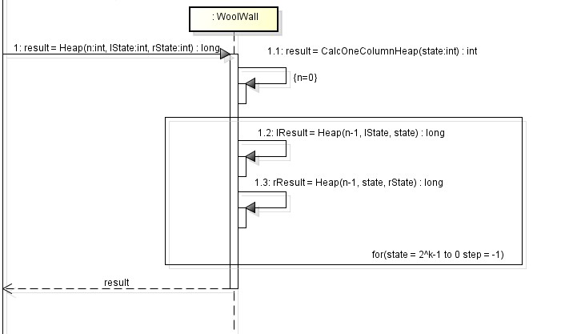

&emsp;&emsp;上图反应了Heep调用的主要方法调用，在循环中，result 累加 lResult 和 rResult。

&emsp;&emsp;&emsp;&emsp;①在实际代码中，首先是从缓存中读取结果，如果没有缓存中读取结果在进行计算。 

分解法分解到一列时，不在分解，直接计算机过

```cs
if (n == 0)  
{  
     return CalcOneColumnHeap(lState);  
} 
```

&emsp;&emsp;&emsp;&emsp;②下面是整个程序的核心代码，通过for循环，求和state=0到state=2^k-1的两边木墙乘积：

```cs
for (int state = 0; state <= maxState; state++)  
{  
    if (n == 1)  
    {  
        if (!StateIsAvailable(n, lState, rState, state))  
        {  
            continue;  
        }  
        result += Heap(n - 1, state | lState, state | lState) *  
            Heap(n - 1, state | rState, state | rState);  
    }  
    else  
    {  
        result += Heap(n - 1, lState, state)  
            * Heap(n - 1, state, rState);  
    }  
    result %= 1000000007;  
}  
```

&emsp;&emsp;当n=1切分时，需要特殊考虑。如下图：


&emsp;&emsp;&emsp;&emsp;&emsp;&emsp;&emsp;&emsp;&emsp;&emsp;&emsp;&emsp;&emsp;&emsp;&emsp;&emsp;图2-8

&emsp;&emsp;看上图中，因为左边墙中间被绿色方块占用，所以在（1,0）-（1,1）这个位置（位置的标记方法同解法一）不能再放绿色方块。所以一些状态需要排除，如state=2需要排除。同时在还需要合并状态，如state=1时，左边墙的状态=3。

&emsp;&emsp;特别说明下：依据我们上文2.2节中的公式，如果第i行有这种木块，state对应2^(i-1)，加上所有行的贡献就得到state（0就是没有这种横跨木块，2^k-1就是所有行都是横跨木块），然后遍历state，还记得上文中的图2-7么？


&emsp;&emsp;当第i行被这样的木块或这样的木块占据时，其各自对应的state值分别为：

&emsp;&emsp;1.当第1行被占据，state=1；

&emsp;&emsp;2.当第2行被占据，state=2；

&emsp;&emsp;3.当第1和第2行都被占据，state=3；

&emsp;&emsp;4.当第3行被占据，state=4；

&emsp;&emsp;5.当第1和第3行被占据，state=5；

&emsp;&emsp;6.当第2和第3行被占据，state=6；

&emsp;&emsp;7.当第1、2、3行全部都被占据，state=7。

&emsp;&emsp;至于原因，即如2.1.3节节末所说：二进制表示为：000 001 010 011 100 101 110 111，它们各自分别对应整数则是：0 1 2 3 4 5 6 7。

&emsp;&emsp;具体来说，下面图中所有框出来的位置，不能有绿色的：

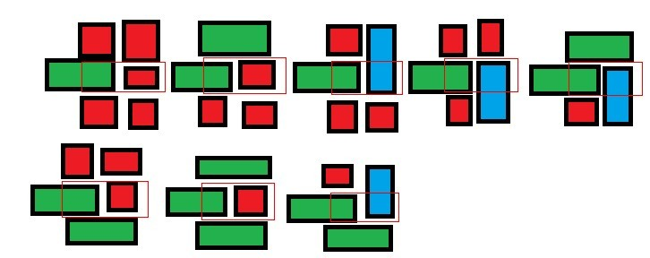

&emsp;&emsp;&emsp;&emsp;③CalcOneColumnHeap(int state)函数用于计算一列时摆放方案数。

&emsp;&emsp;计算方法是， 求和被绿色木块分割开的每一段连续方格的摆放方案数。每一段连续的方格的摆放方案通过CalcAllState方法求得。经过分析，可以得知CalcAllState是类似斐波那契序列的函数。

&emsp;&emsp;举个例子如下（分步骤讲述）：

&emsp;&emsp;1.令state = 4546（state=2^k-1，k最大为4，故本题中state最大在15，而这里取state=4546只是为了演示如何计算），二进制是：1000111000010。位置上为1，表示被绿色木块占用，0表示空着，可以自由摆放。

&emsp;&emsp;2.1000111000010  被分割后 1  000  111  0000  1  0, 那么就有 000=3个连续位置， 0000=4个连续位置 ， 0=1个连续位置。

&emsp;&emsp;3.堆放结果=CalcAllState(3) + CalcAllState(4) + CalcAllState(1) = 3 + 5 + 1 = 9。

####2.4、再次优化

&emsp;&emsp;上面程序因为调用性能的树形结构，形成了大量的函数调用和缓存查找，所以其性能不是很高。 为了得到更高的性能，可以让所有的运算直接依赖于上一次运算的结果，以防止更多的调用。即如果每次运算都算出所有边界状态的结果，那么就能为下一次运算提供足够的信息。后续优化请查阅此文第3节：<http://blog.csdn.net/dw14132124/article/details/9038417#t2>。


###解法三、动态规划

相信读到上文，不少读者都已经意识到这个问题其实就是一个动态规划问题，接下来咱们换一个角度来分析此问题。

####3.1、暴力搜索不可行

&emsp;&emsp;首先，因为木块的宽度都是1，我们可以想成2维的问题。也就是说三种木板的规格分别为1* 1, 1 * 2, 2 * 1。

&emsp;&emsp;通过上文的解法一，我们已经知道这个问题最直接的想法就是暴力搜索，即对每个空格尝试放置哪种木板。但是看看数据规模就知道，这种思路是不可行的。因为有一条边范围长度高达21024，普通的电脑，230左右就到极限了。于是我们得想想别的方法。

####3.2、另辟蹊径

&emsp;&emsp;为了方便，我们把墙看做有2n行，k列的矩形。这是因为虽然矩形木块不能翻转，但是我们同时拥有1*2和2*1的两种木块。

&emsp;&emsp;假设我们从上到下，从左到右考虑每个1*1的格子是如何被覆盖的。显然，我们每个格子都要被覆盖住。木块的特点决定了我们覆盖一个格子最多只会影响到下一行的格子。这就可以让我们暂时只考虑两行。

&emsp;&emsp;假设现我们已经完全覆盖了前(i– 1)行。那么由于覆盖前(i-1)行导致第i行也不“完整”了。如下图：

&emsp;&emsp;&emsp;&emsp;&emsp;&emsp;xxxxxxxxx

&emsp;&emsp;&emsp;&emsp;&emsp;&emsp;ooxooxoxo

&emsp;&emsp;我们用x表示已经覆盖的格子，o表示没覆盖的格子。为了方便，我们使用9列。

&emsp;&emsp;我们考虑第i行的状态，上图中，第1列我们可以用1*1的覆盖掉，也可以用1*2的覆盖前两列。第4、5列的覆盖方式和第1、2列是同样的情况。第7列需要覆盖也有两种方式，即用1*1的覆盖或者用2*1的覆盖，但是这样会导致第（i+1)行第7列也被覆盖。第9列和第7列的情况是一样的。这样把第i行覆盖满了之后，我们再根据第(i+1)行被影响的状态对下一行进行覆盖。

&emsp;&emsp;那么每行有多少种状态呢？显然有2k，由于k很小，我们只有大约16种状态。如果我们对于这些状态之间的转换制作一个矩阵，矩阵的第i行第j列的数表示的是我们第m行是状态i，我们把它完整覆盖掉，并且使得第(m + 1)行变成状态j的可能的方法数，这个矩阵我们可以暴力搜索出来，搜索的方式就是枚举第m行的状态，然后尝试放木板，用所有的方法把第m行覆盖掉之后，下一行的状态。当然，我们也可以认为只有两行，并且第一行是2k种状态的一种，第二行起初是空白的，求使得第一行完全覆盖掉，第二行的状态有多少种类型以及每种出现多少次。

####3.3、动态规划

&emsp;&emsp;这个矩阵作用很大，其实我们覆盖的过程可以认为是这样：第一行是空的，我们看看把它覆盖了，第2行是什么样子的。根据第二行的状态，我们把它覆盖掉，看看第3行是什么样子的。

&emsp;&emsp;如果我们知道第i行的状态为s,怎么考虑第i行完全覆盖后，第(i+1)行的状态？那只要看那个矩阵的状态s对应的行就可以了。我们可以考虑一下，把两个这样的方阵相乘得到得结果是什么。这个方阵的第i行第j个元素是这样得到的，是第i行第k个元素与第k行第j个元素的对k的叠加。它的意义是上一行是第m行是状态i，把第m行和第(m+ 1)行同时覆盖住，第(m+2)行的状态是j的方法数。这是因为中间第(m+1)行的所有状态k，我们已经完全遍历了。

&emsp;&emsp;于是我们发现，每做一次方阵的乘法，我们相当于把状态推动了一行。那么我们要坐多少次方阵乘法呢？就是题目中墙的长度2<sup>n</sup>,这个数太大了。但是事实上，我们可以不断地平方n次。也就是说我们可以算出A<sup>2</sup>,A<sup>4</sup>, A<sup>8</sup>, A<sup>16</sup>……方法就是不断用结果和自己相乘，这样乘n次就可以了。

&emsp;&emsp;因此，我们最关键的问题就是建立矩阵A。我们可以这样表示一行的状态，从左到右分别叫做第0列，第1列……覆盖了我们认为是1，没覆盖我们认为是0，这样一行的状态可以表示维一个整数。某一列的状态我们可以用为运算来表示。例如，状态x第i列是否被覆盖，我们只需要判断x & (1 << i) 是否非0即可，或者判断(x >> i) & 1， 用右移位的目的是防止溢出，但是本题不需要考虑溢出，因为k很小。 接下来的任务就是递归尝试放置方案了

####3.4、参考代码

&emsp;&emsp;最终结果，我们最初的行是空得，要求最后一行之后也不能被覆盖，所以最终结果是矩阵的第[0][0]位置的元素。另外，本题在乘法过程中会超出32位int的表示范围，需要临时用C/C++的long long，或者java的long。

&emsp;&emsp;参考代码如下：

```c
//copyright@caopengcs 12/08/2013  
#ifdef WIN32  
#define ll __int64   
#else  
#define ll long long  
#endif  
  
// 1 covered 0 uncovered  
  
void cal(int a[6][32][32],int n,int col,int laststate,int nowstate) {  
    if (col >= n) {  
        ++a[n][laststate][nowstate];  
        return;  
    }  
    //不填 或者用1*1的填  
    cal(a,n, col + 1, laststate, nowstate);  
    if (((laststate >> col) & 1) == 0) {  
        cal(a,n, col + 1, laststate, nowstate | (1 << col));  
        if ((col + 1 < n) && (((laststate >> (col + 1)) & 1) == 0)) {  
            cal(a,n, col + 2, laststate, nowstate);  
        }  
    }  
}  
  
inline int mul(ll x, ll y) {  
    return x * y % 1000000007;  
}  
  
void multiply(int n,int a[][32],int b[][32]) { // b = a * a  
    int i,j, k;  
    for (i = 0; i < n; ++i) {  
        for (j = 0; j < n; ++j) {  
            for (k = b[i][j] = 0; k < n; ++k) {  
                if ((b[i][j] += mul(a[i][k],a[k][j])) >= 1000000007) {  
                    b[i][j] -= 1000000007;  
                }  
            }  
        }  
    }  
}  
  
int calculate(int n,int k) {  
    int i, j;  
    int a[6][32][32],mat[2][32][32];  
    memset(a,0,sizeof(a));  
    for (i = 1; i <= 5; ++i) {  
        for (j = (1 << i) - 1; j >= 0; --j) {  
            cal(a,i, 0, j, 0);  
        }  
    }  
    memcpy(mat[0], a[k],sizeof(mat[0]));  
    k = (1 << k);  
    for (i = 0; n; --n) {  
        multiply(k, mat[i], mat[i ^ 1]);  
        i ^= 1;  
    }  
    return mat[i][0][0];  
}  
```

##参考链接及推荐阅读

1. caopengcs，最小操作数：<http://blog.csdn.net/caopengcs/article/details/9919341>；</br>
2. caopengcs，木块砌墙：<http://blog.csdn.net/caopengcs/article/details/9928061>；</br>
3. 红色标记，木块砌墙：<http://blog.csdn.net/dw14132124/article/details/9038417>；</br>
4. LoveHarvy，木块砌墙：<http://blog.csdn.net/wangyan_boy/article/details/9131501>；</br>
5. 在线编译测试木块砌墙问题：<http://hero.pongo.cn/Question/Details?ID=36&ExamID=36>；</br>
6. 编程艺术第29章字符串编辑距离：<http://blog.csdn.net/v_july_v/article/details/8701148#t4>；</br>
7. matrix67，十个利用矩阵乘法解决的经典题目：<http://www.matrix67.com/blog/archives/276>；</br>
8. leetcode上最小操作数一题：<http://leetcode.com/onlinejudge#question_126>；</br>
9. hero上木块砌墙一题：<http://hero.pongo.cn/Question/Details?ExamID=36&ID=36&bsh_bid=273040296>；</br>
10. 超然烟火，<http://blog.csdn.net/sunnianzhong/article/details/9326289>；</br>

##后记

&emsp;&emsp;在本文的创作过程中，caopengcs开始学会不再自以为是了，意识到文章应该尽量写的详细点，很不错；而红色标记把最初的关于木块砌墙问题的原稿给我后，被我拉着来来回回修改了几十遍才罢休，尤其画了不少的图，辛苦感谢。

&emsp;&emsp;此外，围绕"编程”"面试”"算法”3大主题的程序员编程艺术系列<http://blog.csdn.net/v_JULY_v/article/details/6460494>，始创作于2011年4月，那会还在学校，如今已写了33章，今年内我会Review已写的这33章，且继续更新，朋友们若有发现任何问题，欢迎随时评论于原文下或向我反馈，我会迅速修正，感激不尽。

&emsp;&emsp;July、二零一三年八月十四日。

